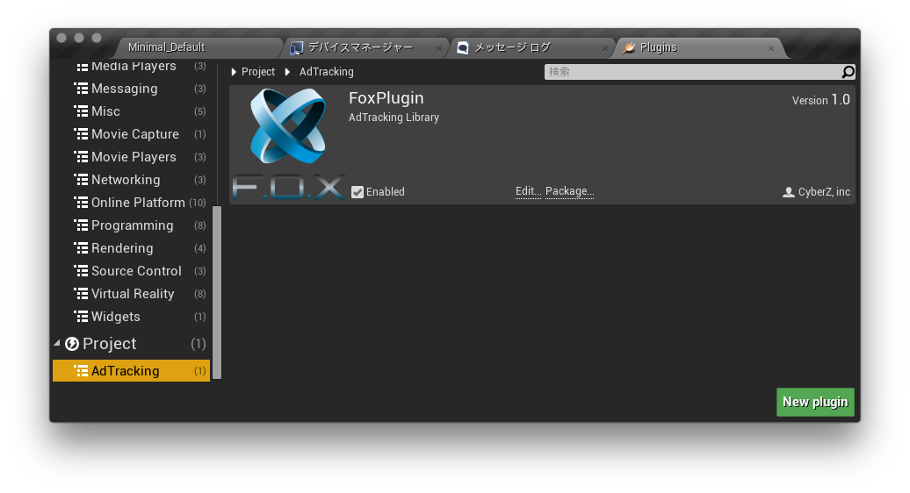
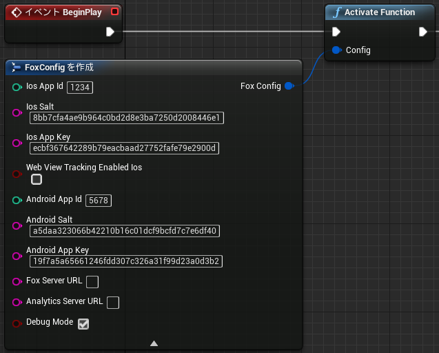
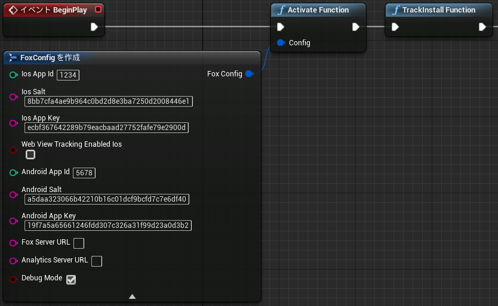
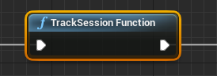
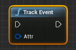
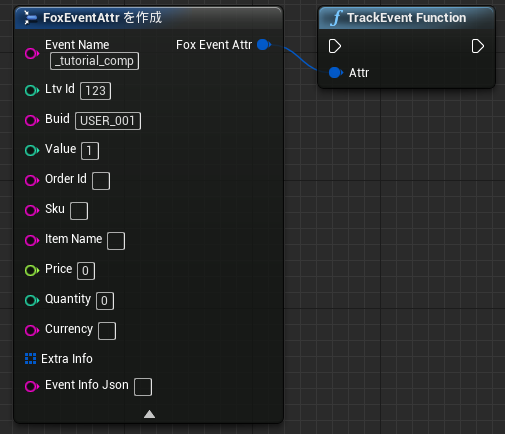
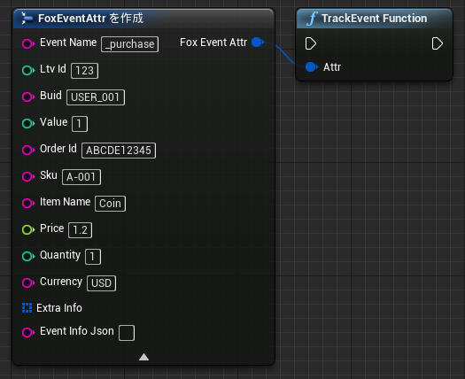

# Force Operation Xとは

Force Operation X (以下F.O.X)は、スマートフォンにおける広告効果最適化のためのトータルソリューションプラットフォームです。アプリケーションのダウンロード、ウェブ上でのユーザーアクションの計測はもちろん、スマートフォンユーザーの行動特性に基づいた独自の効果計測基準の元、企業のプロモーションにおける費用対効果を最大化することができます。

本ドキュメントでは、スマートフォンアプリケーションにおける広告効果最大化のためのF.O.X SDK導入手順について説明します。

## 目次

* **[1. インストール](#install_sdk)**
  * [SDKダウンロード](https://github.com/cyber-z/public-fox-unrealengine-sdk/releases)
  * [iOSプロジェクトの設定](./doc/integration/ios/README.md)
  * [Androidプロジェクトの設定](./doc/integration/android/README.md)
* **[2. F.O.X SDKのアクティベーション](#activate_sdk)**
* **[3. インストール計測の実装](#track_install)**
	*	[インストール計測の詳細](./doc/track_install/README.md)
* **[4. アプリ内イベントの計測](#track_event)**
	* [セッション(起動)イベントの計測](#track_event)
	* [その他アプリ内イベントの計測](#track_other_event)
	* [イベント計測の詳細](./doc/track_event/README.md)
* **[5. 最後に必ずご確認ください](#trouble_shooting)**

---

## F.O.X SDKとは

F.O.X SDKをアプリケーションに導入することで、以下の機能を実現します。

* **インストール計測**

広告流入別にインストール数を計測することができます。

* **LTV計測**

流入元広告別にLife Time Valueを計測します。主な成果地点としては、会員登録、チュートリアル突破、課金などがあります。各広告別に登録率、課金率や課金額などを計測することができます。

* **アクセス解析**

自然流入と広告流入のインストール比較。アプリケーションの起動数やユニークユーザー数(DAU/MAU)。継続率等を計測することができます。


<div id="install_sdk"></div>
## 1. インストール

以下のページより最新のSDKをダウンロードしてください。

[SDKリリースページ](https://github.com/cyber-z/public-fox-unrealengine-sdk/releases)

ダウンロードしたSDK「FOX_UE4_Plugin_&lt;version&gt;.zip」を展開し、`Plugins`の`CYZFox`をアプリケーションのプロジェクトに組み込見ます。<br>
プロジェクトディレクトリ直下の`Plugins`に解凍したSDKディレクトリを配置します。


> `Plugins`ディレクトリがない場合、作成して配置してください。

PluginsディレクトリにSDKを配置すると、UnrealEditorのPlugins一覧 ( [設定] > [Plugins] )に`CyberZ Fox`が表示されます。<br>
導入するPluginの`Enabled`にチェックを入れて、UnrealEditorを再起動することでプロジェクトへの導入は完了です。

* `FOX SDK` : SDK本体となるPluginです。必ずEnableにチェックを入れてください。
* `FOX SDK Blueprint Library` : ブループリントでFOX SDKをコールする場合にEnableにチェックを入れてください。




### 各OS毎の設定

* [iOSプロジェクトの設定](./doc/integration/ios/README.md)
* [Androidプロジェクトの設定](./doc/integration/android/README.md)

<div id="activate_sdk"></div>
## 2. F.O.X SDKのアクティベーション

F.O.X SDKのアクティベーションを行うため、アプリの起動時点に以下の実装を行います。<br>
実装方法にはブループリントとC++の２通りで提供しています。

#### [ ブループリント ]

* レベルブループリント(`[ブループリント] > [レベルブループリントを開く]`)を開きます。

* `イベント BeginPlay`を配置します。
* 何もない箇所を右クリックして`Fox Track`のノードを検索します。
* Fox Trackの一覧から`Activate Function`を選択し配置します。


|パラメータ|型|説明|
|:---|:---:|:---|
|Ios AppId|int|管理画面で発行されるiOSアプリ用の計測用ID|
|Ios App Salt|char|管理画面で発行されるiOS用ソルト|
|Ios App Key|char|管理画面で発行されるiOS用アプリキー|
|Ios Web View Tracking Enabled|bool|Webブラウザを利用してイベント計測を実施する場合、`true`に設定します。|
|AndroidAppId|int|管理画面で発行されるiOS用の計測用ID|
|AndroidSalt|char|管理画面で発行されるAndroid用ソルト|
|AndroidAppKey|char|管理画面で発行されるAndroid用アプリキー|
|DebugMode|bool|デバッグ用ログ出力有効フラグ<br>デフォルト : false|


#### **[ C++ ]**

CYZFox.hをインクルードし、アプリ起動時に必ず呼ばれるBeginPlayメソッド内で<br>
CYZUEFoxConfigを設定しactivateを実行します。

```cpp
#include "CYZFox.h"
using namespace fox;
...

void FoxSample::BeginPlay()
{
  CYZUEFoxConfig config;
  config.ios_appId = 発行されたiOSアプリID;
  config.ios_salt = "発行されたiOSアプリのAPP_SALT";
  config.ios_appKey = "発行されたiOSアプリのAPP_KEY";
  config.android_appId = 発行されたAndroidアプリID;
  config.android_salt = "発行されたAndroidアプリのAPP_SALT";
  config.android_appKey = "発行されたAndroidアプリのAPP_KEY";
  config.debugMode = true;
  CYZFox::activate(config);
}
```


<div id="track_install"></div>
## 3. インストール計測の実装

初回起動のインストール計測を実装することで、広告の効果測定を行うことができます。

### インストール計測の実装

#### [ ブループリント ]

以下の様に`TrackInstall`ノードを追加します。<br>
Activate直後に呼び出すことが望ましいですが、別のBeginPlayで呼び出す場合は必ずアプリ起動時且つ、Activateの後に実行されるよう
設定してください。



> ※ TrackInstallは必ずActivateの後に呼ばれるよう設定してください。Activateよりも前に実行した場合、必須設定情報をロードしていないため計測を行うことができません。

#### [ C++ ]

インストール計測を行うには、BeginPlayで`CYZFox::trackInstall`をコールします。

```cpp
#include "CYZFox.h"
using namespace fox;
...

void FoxSample::BeginPlay()
{
  CYZFox::trackInstall();
}
```

> ※ trackInstallは必ずactivateの後に呼ばれるよう設定してください。activateよりも前に実行した場合、必須設定情報をロードしていないため計測を行うことができません。

*	[インストール計測の詳細](./doc/track_install/README.md)

<div id="track_event"></div>
## 4. アプリ内イベントの計測

起動セッション、会員登録、チュートリアル突破、課金など任意の成果地点にイベント計測を実装することで、流入元広告のLTVや継続率を測定することができます。それらの計測が不要の場合には、各項目の実装を省略できます。

<div id="track_session"></div>
### セッション(起動)イベントの計測

自然流入と広告流入のインストール数比較、アプリケーションの起動数やユニークユーザー数(DAU/MAU)、継続率等を計測することができます。アクセス解析が不要の場合には、本項目の実装を省略できます。
<br>
アプリケーションが起動、もしくはバックグラウンドから復帰する際にセッション計測を行うコードを追加します。不要の場合には、本項目の実装を省略できます。

#### [ ブループリント ]

TrackSessionノードを追加し呼び出します。



#### [ C++ ]

```cs
#include "CYZFox.h"
using namespace fox;
...

	CYZFox.trackSession();
```

<div id="track_other_event"></div>
### その他アプリ内イベントの計測

会員登録、チュートリアル突破、課金など任意の成果地点にイベント計測を実装することで、流入元広告のLTVを測定することができます。<br>
イベント計測が不要の場合には、本項目の実装を省略できます。<br>
成果がアプリ内部で発生する場合、ブループリントまたはC++で成果処理部に以下の例のように実行してください。<br>

イベント計測にはCYZFoxEvent.hに計測対象となるイベントの各パラメータを格納し、CYZFox::trackEventの引数として計測します。

#### **[チュートリアルイベントの計測例]**

#### [ ブループリント ]

* イベントが発生するタイミングでTrackEventノードを追加します。
<br><br>

<br><br>
* `Attr`からノード追加メニューを開き、`変数へ昇格`を選択します。

<br><br>
* 追加した変数に各パラメータをセットします。このチュートリアルイベントの設定例として以下の値を設定しています。<br><br>
・EventName : _tutorial_complete<br>
・Ltv Id : 191 (管理画面で発行されるIDです)<br>
・Buid : User_001
<br><br>

<br><br>

値を動的に設定する場合は、変数への昇格は実行せず直接各パラメータに値を設定します。




#### [ C++ ]

コードで実装する場合は以下のように実装します。

```cs
#include "CYZFox.h"
#include "CYZFoxEvent.h"

using namespace fox;
...
  const char* eventName = "_tutorial_comp";
  uint ltvId = 成果地点ID;
  CYZFoxEvent e = new CYZFoxEvent(eventName, ltvId);
  e.buid = "USER_001"
  CYZFox::trackEvent(e);
```

> 成果地点ID(必須)：管理者より連絡します。その値を入力してください。

> LTV計測を行うためには、各成果地点を識別する`成果地点ID`を指定する必要があります。FoxEventのコンストラクタの第二引数に発行されたIDを指定してください。

#### **[課金イベントの計測例]**

#### [ ブループリント ]



#### [ C++ ]

課金計測を行う場合には、課金が完了した箇所で以下のように課金額を指定してください。

```cs
using Cyz;
...

	int ltvId = 成果地点ID;
	double price = 1.2;
	String currency = "USD";
	CYZFoxEvent purchase = CYZFoxEvent::makePurchase("_purchase", ltvId, price, currency);
	purchase.buid = "USER_001"
	purchase.orderId = "ABCDEFG12345";
	purchase.itemName = "Coin";
	purchase.sku = "A-001"
	purchase.quantity = 1;
	CYZFox::trackEvent(purchase);
```

> currencyの指定には[ISO 4217](http://ja.wikipedia.org/wiki/ISO_4217)で定義された通過コードを指定してください。

* [イベント計測の詳細](./doc/track_event/README.md)

<div id="trouble_shooting"></div>
## 5. 最後に必ずご確認ください（これまで発生したトラブル集）

### 5.1. URLスキームの設定がされずリリースされたためブラウザからアプリに遷移ができない

Cookie計測を行うために外部ブラウザを起動した後に、元の画面に戻すためにはURLスキームを利用してアプリケーションに遷移させる必要があります。この際、独自のURLスキームが設定されている必要があり、URLスキームを設定せずにリリースした場合にはこのような遷移を行うことができなくなります。

### 5.2. URLスキームに大文字や記号が含まれ、正常にアプリに遷移されない

環境によって、URLスキームの大文字小文字が判別されないことにより正常にURLスキームの遷移が行えない場合があります。URLスキームは全て小文字の英数字で設定を行ってください。


### 5.3. URLスキームの設定が他社製アプリと同一でブラウザからそちらのアプリが起動してしまう

iOSにおいて、複数のアプリに同一のURLスキームが設定されていた場合に、どのアプリが起動するかは不定です。確実に特定のアプリを起動することができなくなるため、URLスキームは他社製アプリとはユニークになるようある程度の複雑性のあるものを設定してください。

### 5.4. 短時間で大量のユーザー獲得を行うプロモーションを実施したら正常に計測がされなかった

iOSには、アプリ起動時に一定時間以上メインスレッドがブロックされるとアプリケーションを強制終了する仕様があります。起動時の初期化処理など、メインスレッド上でサーバーへの同期通信を行わないようにご注意ください。リワード広告などの大量のユーザーを短時間で獲得した結果、サーバーへのアクセスが集中し、通信のレスポンスが非常に悪くなることでアプリケーションの起動に時間がかかり、起動時に強制終了され正常に広告成果が計測できなくなった事例がございます。

以下の手順で、こうした状況をテストすることができますので、以下の設定でアプリケーションが正常に起動するかをご確認ください。

`iOS「設定」→「デベロッパー」→「NETWORK LINK CONDITIONER」`

* 「Enable」をオン
* 「Very Bad Network」をチェック


### 5.5. F.O.Xで確認できるインストール数の値がGoogle Play Developer Consoleの数字より大きい

F.O.Xではいくつかの方式を組み合わせて端末の重複インストール検知を行っています。
重複検知が行えない設定では、同一端末でも再インストールされる度にF.O.Xは新規のインストールと判定してしまいます。

重複検知の精度を向上するために、以下の設定を行ってください。

* [（オプション）外部ストレージを利用した重複排除設定](/lang/ja/doc/integration/android/external_storage/README.md)

---
[トップメニュー](/README.md)
