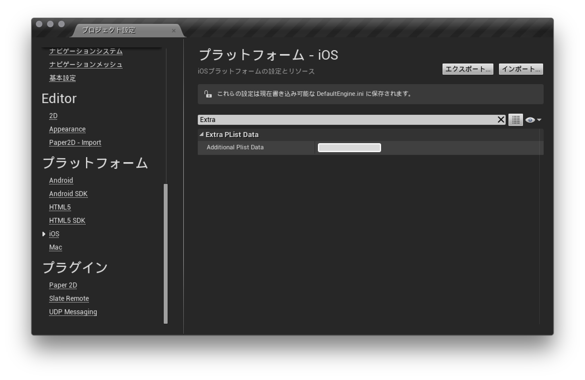

# Force Operation Xとは

Force Operation X (以下F.O.X)は、スマートフォンにおける広告効果最適化のためのトータルソリューションプラットフォームです。アプリケーションのダウンロード、ウェブ上でのユーザーアクションの計測はもちろん、スマートフォンユーザーの行動特性に基づいた独自の効果計測基準の元、企業のプロモーションにおける費用対効果を最大化することができます。

本ドキュメントでは、スマートフォンアプリケーションにおける広告効果最大化のためのF.O.X SDK導入手順について説明します。

## F.O.X SDKとは

F.O.X SDKをアプリケーションに導入することで、以下の機能を実現します。

* **インストール計測**

広告流入別にインストール数を計測することができます。

* **LTV計測**

流入元広告別にLife Time Valueを計測します。主な成果地点としては、会員登録、チュートリアル突破、課金などがあります。各広告別に登録率、課金率や課金額などを計測することができます。

* **アクセス解析**

自然流入と広告流入のインストール比較。アプリケーションの起動数やユニークユーザー数(DAU/MAU)。継続率等を計測することができます。

# 1.	概要

本ドキュメントでは、Force Operation X UnrealEngine(以下、UE) SDK プラグインの導入手順について説明します。Force Operation X UE SDKプラグインはiOSおよびAndroidに対応しています。

Force Operation X SDKでは、インストールおよびLTVの計測、アクセス解析を行うことができます。

SDKの実装後は、アプリケーションの動作及び効果測定の結果に問題のないことを確認した後にマーケットへの申請を行ってください。効果測定のテスト手順については、Force Operation X管理者よりご連絡いたします。

## 1.1	SDK仕様


F.O.X SDKをアプリケーションに導入することで、以下の機能を実現します。


|処理|必須|概要|
|:------:|:------:|:------|
|インストール計測|必須|起動時はブラウザが起動し、Cookie計測により広告効果測定を行います。<br>コンバージョン数、CVRなどを測定することができます。<br>メソッド名：sendConversion|
|LTV計測|オプション|任意の成果地点で成果通知を行い、広告別の課金数や入会数の計測を行います。<br>課金金額、退会数などを測定することができます。<br>メソッド名：sendLtv|
|アクセス解析|オプション|アプリの起動時およびバックグラウンドからの復帰時の起動計測を行います。<br>起動数、アクティブユーザー数(DAU)、継続率などを測定することができます。<br>メソッド名：sendStartSession|

> Force Operation X SDK UE プラグインは、ネイティブ版SDKへのブリッジを行うラッパーとして実装しています。SDK導入には、プラグインと、iOS及びAndroidのネイティブ版SDKが必要となります。


## 1.2	SDKの展開

ダウンロードしたSDK「FOX_UnrealEngine_SDK_<version>.zip」をOS上に展開します。
Sourceフォルダ内に同梱されているファイルは以下の通りです。

ファイル名|必須|概要
:--------:|:-------------:|:--------
FoxUePlugin.h|必須|ヘッダファイル。UEのC++上からSDKを使用するためのラッパー
FoxUePlugin.mm|	iOS専用	|ライブラリファイル。UEのC++からFOX iOS SDKを使用するためのiOS用のラッパー
FoxUePlugin.cpp|Android専用|ライブラリファイル。UEのC++からFOX Android SDKを使用するためのAndroid用のラッパー
FoxUIApplication.h|iOS専用<br>必須|ヘッダファイル。UE上のC++からリエンゲージメント計測機能を有効にするためiOSのopenURLメソッドをoverrideするラッパー
FoxUIApplication.m|iOS専用<br>必須|ライブラリファイル。UE上のC++からリエンゲージメント計測機能を有効にするためiOSのopenURLメソッドをoverrideするラッパー|
iOSのネイティブSDKは`ThirdParty/FoxSDK/iOS`フォルダに同梱されています。

ファイル名|必須|概要
:--------:|:-------------:|:--------
FoxSDK.Build.cs|必須|iOSの計測用ライブラリファイルを読み込むための設定ファイル。
AdManager.h|必須|ヘッダファイル。広告の効果測定を行う。
libAppAdForce.a|必須|ライブラリファイル。広告の効果測定を行う。
Ltv.h|オプション|ヘッダファイル。LTV計測を行う。
AnalyticsManager.h|オプション|ヘッダファイル。アクセス解析を行う。


 AndroidのネイティブSDKは`Intermediate/Android/APK/libs`フォルダに同梱されています。

|ファイル名|必須|概要|
|:------:|:------:|:------|
|AppAdForce_vX.XXg.jar|必須|AndroidのネイティブSDK。通常成果・LTV成果・アクセス解析を計測することができます。|

各ライブラリファイルの格納イメージ

```
|- ThirdParty
|   |- FoxSDK
|       |- FoxSDK.Build.cs
|       |- iOS
|           |- AdManager.h
|           |- Ltv.h
|           |- AnalyticsManager.h
|           |- libAppAdForce.a
|- Source
|   |- FoxUePlugin.h
|   |- iOS
|       |- FoxUePlugin.mm
|       |- FoxUIApplication.h
|       |- FoxUIApplication.mm
|   |- Android
|       |- FoxUePlugin.cpp
|- Intermediate
|   |- Android
|       |- APK
|           |- libs
|               |- AppAdForce_vX.XXg.jar
```

* 「FOX_UnrealEngine_SDK_{version}.zip」に「AppAdForce_vX.XXg.jar」ファイルが含まれていない場合はSDKダウンロードサイトからFOX_Android_SDK_{version}.zipをダウンロードの上、ご使用ください。
* 「FOX_UnrealEngine_SDK_{version}.zip」にネイティブSDKファイルが含まれていない場合は、SDKダウンロードサイトからFOX_iOS_SDK_{version}.zipをダウンロードの上、ご使用ください。

# 2.	iOS用 Xcode プロジェクトの設定

## 2.1	ライブラリの組み込み

1. `ThirdParty/FoxSDK`フォルダを`/Users/Shared/UnrealEngine/4.X/Engine/Source/ThirdParty/`の下にコピーする。
2. `Source/FoxUePlugin.h`ファイルを`$PROJECT_HOME/Source/$PROJECT_NAME`の下にコピーする。
3. `Source/iOS`フォルダに格納されている全てのファイルを`$PROJECT_HOME/Source/$PROJECT_NAME`の下にコピーする。
4. `AppAdForce.plist`ファイルを`$PROJECT_HOME/Saved/StagedBuilds/IOS/`の下にコピーする。
5. `$PROJECT_HOME/Source/$PROJECT_NAME/$PROJECT_NAME.Build.cs`を更新する。
```cs
if (Target.Platform == UnrealTargetPlatform.IOS) {
    PublicDependencyModuleNames.AddRange(new string[] {"FoxSDK"});
}
```
6. UNREAL EDITORの [Settings] > [Project Settings] > [iOS] > [Extra Plist Data]で以下の設定を追加する。 **`{my.scheme}`** にはアプリを起動するためのURLスキームを指定する。
```xml
<key>CFBundleURLTypes</key>
  <array>
    <dict>
      <key>CFBundleTypeRole</key>
      <string>Editor</string>
      <key>CFBundleURLSchemes</key>
        <array>
          <string>{my.scheme}</string>
        </array>
    </dict>
  </array>
<key>NSAppTransportSecurity</key>
<dict>
  <key>NSExceptionDomains</key>
    <dict>
      <key>app-adforce.jp</key>
        <dict>
          <key>NSExceptionAllowsInsecureHTTPLoads</key>
          <true/>
        </dict>
      <key>analytics.app-adforce.jp</key>
        <dict>
          <key>NSExceptionAllowsInsecureHTTPLoads</key>
          <true/>
        </dict>
    </dict>
</dict>
```



## 2.2 SDKの設定

SDKの動作に必要な設定をplistに追加します。`$PROJECT_HOME/Saved/StagedBuilds/IOS/`の下にコピーした「AppAdForce.plist」ファイルに、次のキーと値を入力してください。

|Key|Type|Value|
|:------:|:------:|:------|
|APP_ID|String|Force Operation X管理者より連絡しますので、その値を入力してください。|
|SERVER_URL|String|Force Operation X管理者より連絡しますので、その値を入力してください。|
|APP_SALT|String|Force Operation X管理者より連絡しますので、その値を入力してください。|
|APP_OPTIONS|String|何も入力せず、空文字の状態にしてください。|
|CONVERSION_MODE|String|1 固定|
|ANALYTICS_APP_KEY|String|Force Operation X管理者より連絡しますので、その値を入力してください。<br />アクセス解析を利用しない場合は設定の必要はありません。|

[AppAdForce.plist記載例]


[SDK設定の詳細](./doc/config_plist/)

[AppAdForce.plistサンプル](./doc/config_plist/AppAdForce.plist)


# 3.	Android用 プロジェクトの設定

## 3.1	プロジェクトへの導入

### 3.1.1 UnrealEngineプロジェクトへの導入

「FOX_UnrealEngine_SDK_<version>.zip」を展開し、以下の操作を行います。

* `Source`配下の"FoxUePlugin.h"と`Source/Android`配下の"FoxUePlugin.cpp"を`$PROJECT_HOME/Source/$PROJECT_NAME`配下にコピーしUNREAL EDITORで行うビルドに含めます。

### 3.1.2 Androidプロジェクトへの導入

* `Intermediate/Android/APK`配下の「AppAdForce_vX.XX.jar」を`$PROJECT_HOME/Intermediate/Android/APK/libs`フォルダにコピーします。

[Eclipseプロジェクトへの導入の方法](./doc/integration/eclipse/)

## 3.2 AndroidManifest.xmlの編集

`$PROJECT_HOME/Intermediate/Android/APK/AndroidManifest.xml`を編集し計測に必須となる情報を定義します。

### 3.2.1 パーミッションの設定

Force Operation X SDKの実行に必要なパーミッションの設定をmanifestタグ内に追加します。

```xml
<uses-permission android:name="android.permission.INTERNET" />
<uses-permission android:name="android.permission.ACCESS_NETWORK_STATE" />
<uses-permission android:name="android.permission.READ_EXTERNAL_STORAGE" />
<uses-permission android:name="android.permission.WRITE_EXTERNAL_STORAGE" />
```

### 3.2.2 メタデータの設定

|パラメータ名|必須|概要|
|:------|:------|:------|
|APPADFORCE_APP_ID|必須|Force Operation X管理者より連絡しますので、その値を入力してください。|
|APPADFORCE_SERVER_URL|必須|Force Operation X管理者より連絡しますので、その値を入力してください。|
|APPADFORCE_CRYPTO_SALT|必須|Force Operation X管理者より連絡しますので、その値を入力してください。|
|ANALYTICS_APP_KEY|必須|Force Operation X管理者より連絡しますので、その値を入力してください。|
|APPADFORCE_ID_DIR|オプション|内(外)部ストレージを利用する際、任意の保存するディレクトリ名を指定できます。<br>未指定の場合、パッケージ名でディレクトリが作成されます。|
|APPADFORCE_ID_FILE|オプション|内(外)部ストレージを利用する際、任意の保存する識別子ファイル名を指定できます。<br>未指定の場合、”__FOX_XUNIQ__”でファイルが作成されます。|
|APPADFORCE_USE_EXTERNAL_STORAGE|オプション|0を指定した場合、内(外)部ストレージへの保存は実行しません。|

Force Operation X SDKの実行に必要な情報をapplicationタグ内に追加します。

```xml
<meta-data android:name="APPADFORCE_APP_ID" android:value="1" />
<meta-data android:name="APPADFORCE_SERVER_URL" android:value="012345ABC" />
<meta-data android:name="APPADFORCE_CRYPTO_SALT" android:value="abcdef123" />
<meta-data android:name="ANALYTICS_APP_KEY" android:value="xxxxxx" />
```

### 3.2.3 インストールリファラー計測の設定
インストールリファラー計測を行うために必要な設定をapplicationタグ内に追加します。

```xml
<receiver android:name="jp.appAdForce.android.InstallReceiver"
          android:exported="true">
	        <intent-filter>
		          <action android:name="com.android.vending.INSTALL_REFERRER" />
	        </intent-filter>
</receiver>
```

既に`com.android.vending.INSTALL_REFERRER`に対するレシーバークラスが定義されている場合には、[二つのINSTALL_REFERRERレシーバーを共存させる場合の設定](https://github.com/cyber-z/public_fox_android_sdk/blob/master/doc/install_referrer/ja/README.md)をご参照ください。

### 3.2.4 AndroidManifest.xmlに関連するその他の設定
* [URLスキームの設定](./doc/config_url_scheme/)
* [（オプション）広告IDを利用するためのGoogle Play Services SDKの導入](./doc/google_play_services/)
* [（オプション）外部ストレージを利用した重複排除設定](./doc/external_storage/)
* [AndroidManifest.xmlの設定例](./doc/config_androidManifest/AndroidManifest.xml)


# 4. インストール計測の実装
## 4.1 インストールの計測

初回起動のインストール計測を実装することで、広告の効果測定を行うことができます。初回起動時に、ブラウザを起動し、広告クリック時に付与されたCookieの情報を照合することで、成果の計測を行います。

初回起動の計測を行うために、`BeginPlay()`メソッド等のアプリケーションの起動直後時に必ず呼ばれる箇所に効果測定用の処理を追加します。

・ヘッダファイルをインクルード

```cpp
	#include "FoxUePlugin.h"
```

・成果通知のコードを追加

```cpp
	FoxPlugin::sendConversion();
```

sendConversionメソッドの引数には、通常は上記の通り"default"という文字列をそのまま指定してください。

* [sendConversionの詳細](./doc/send_conversion/)

## 4.2 URLスキーム経由の起動計測(リエンゲージメント計測)

URLスキーム経由の起動を計測するために、各OSで以下の対応が必要となります。

### [iOSの場合]

FoxUIApplication.\* がビルドに含まれていれば、URLスキームでアプリが起動した際に呼ばれるため
実装は必要ありません。


### [Androidの場合]

AndroidManifest.xmlにてURLスキームが設定されている全てのActivityのonResume内に
sendReengagementConversionメソッドを実装します。
主にGameActivityが対象となりますが、他にActivityが存在する場合には各々のActivityにも実装が必要となります。


URLスキームによるアプリケーション起動時の起動計測<br>
（GameActivityクラスへの実装例）

```java
// クラスをインポート
import jp.appAdForce.android.AdManager;


public class GameActivity extends NativeActivity {

    @Override
    protected void onResume() {
        super.onResume();
        AdManager ad = new AdManager(this);
        ad.sendReengagementConversion(getIntent());
    }
}
```

URLスキームで起動されるActivityのlaunchModeが`singleTask`または`singleInstance`の場合は、URLスキーム経由でパラメータを受け取るためにonNewIntentメソッドをoverrideし、以下のようにsetIntentメソッドをコールしてください。

```java
@Override
protected void onNewIntent(Intent intent) {
    super.onNewIntent(intent);
    setIntent(intent);
}
```

# 5. LTV計測の実装


LTV計測により、広告流入別の課金金額や入会数などを計測することができます。計測のために、任意の地点にLTV成果通信を行うコードを追加します。

ソースの編集は、成果が上がった後に実行されるスクリプトに処理を記述します。例えば、会員登録やアプリ内課金後の課金計測では、登録・課金処理実行後のコールバック内にLTV計測処理を記述します。

成果がアプリ内部で発生する場合、成果処理部に以下のように記述してください。

・ヘッダをインクルード

```cpp
	#include "FoxUePlugin.h"
```

・成果計測処理を記述

```cpp
	FoxPlugin::sendLtv(成果地点ID);
```

> 成果地点ID(必須)：管理者より連絡します。その値を入力してください。


* [sendLtvConversionの詳細](./doc/send_ltv_conversion/)


# 6. アクセス解析

アクセス解析を導入することで、自然流入・広告流入別の起動数、アクティブユーザー数(DAU/MAU)や継続率を計測することができます。アクセス解析では、アプリケーションが起動、もしくはバックグラウンドから復帰する際にセッション計測を行うコードを追加します。不要の場合には、本項目の実装を省略できます。

### [iOSの場合]
iOSの場合、以下の設定が必要です。

アプリ起動地点となる箇所に、次の実装をしてください。

・ヘッダをインクルード

```cpp
	#include "FoxUePlugin.h"
```

・セッション計測処理を記述

```cpp
	FoxPlugin::sendStartSession();
```

### [Androidの場合]
Androidの場合、以下の設定が必要です。

アプリケーションの起動及び、バックグラウンドからの復帰を計測するために、ActivityのonResume()にコードを追加します。

アプリケーション起動時の起動計測（GameActivityクラスへの実装例）

```java
// クラスをインポート
import jp.appAdForce.android.AnalyticsManager;

public class GameActivity extends NativeActivity {

	@Override
	protected void onResume() {
		super.onResume();
		AnalyticsManager.sendStartSession(this);
	}
}
```

#### ＜もしJavaのActivity上でonResume()が使えない場合＞

アプリ起動の起点となる箇所で以下のコードを実行します。

```cpp
	#include "FoxUePlugin.h"

---

FoxPlugin::sendStartSession();
```
> ※アプリケーションがバックグラウンドから復帰した際に、そのActivityに起動計測の実装がされていない場合など、正確なアクティブユーザー数が計測できなくなります。<br>
※JavaのActivity内のonResume()とC++の両方でsendStartSession()が実行されていた場合、１ユーザーから２重にアプリ起動情報が送信されるため必ずどちらかで実装してください。


[アクセス解析によるイベント計測](./doc/analytics_event/)

# 7. AndroidプロジェクトでProGuardを利用する場合

ProGuardを利用してF.O.X SDKを導入したアプリケーションを難読化する際に、警告が発生する場合があります。その際には、警告を回避するため以下の設定を追加してください。

```
-libraryjars libs/AppAdForce.jar
-keep interface jp.appAdForce.** { *; }
-keep class jp.appAdForce.** { *; }
-keep class jp.co.dimage.** { *; }
-keep class com.google.android.gms.ads.identifier.* { *; }
-dontwarn jp.appAdForce.android.ane.AppAdForceContext
-dontwarn jp.appAdForce.android.ane.AppAdForceExtension
-dontwarn com.adobe.fre.FREContext
-dontwarn com.adobe.fre.FREExtension
-dontwarn com.adobe.fre.FREFunction
-dontwarn com.adobe.fre.FREObject
-dontwarn com.ansca.**
-dontwarn com.naef.jnlua.**
```

※GooglePlayServiceSDKを導入されている場合、以下のページで記載されているkeep指定が記述されているかご確認ください。

[Google Play Services導入時のProguard対応](https://developer.android.com/google/play-services/setup.html#Proguard)


# 8. 疎通テストの実施

マーケットへの申請までに、Force Operation Xを導入した状態で十分にテストを行い、アプリケーションの動作に問題がないことを確認してください。

効果測定テストの手順については、管理者よりご連絡いたしますのでその手順に従いテストを実施してください。

成果のための通信は、起動後に一度のみ行わるため、二回目以降の起動では通信が発生しません。続けて効果測定テストを行いたい場合には、アプリケーションをアンインストールし、再度インストールから行ってください。

## 8.1 テストの手順

SDKが正常に導入されていることを確認するためのテスト手順は以下の通りです。
ProGuardを掛けてリリースを行う場合、必ずProGuardを掛けた状態でテストの実施をお願い致します。

1. テスト用端末にテストアプリがインストールされている場合には、アンインストール
2. テスト用端末の「設定」→「Safari」→「Cookieとデータを消去」によりCookieを削除
3. 弊社より発行したテスト用URLをクリック<br>
   ※ テスト用URLは必ずOSに設定されているデフォルトブラウザでリクエストされるようにしてください。
デフォルトブラウザとは、URLをクリックした際に自動で起動するブラウザのことです。
メールアプリやQRコードアプリを利用され、そのアプリ内WebViewで遷移した場合には計測できません。
4. マーケットへリダイレクト<br>
   ※ テストURLの場合には、遷移先がなくエラーダイアログが表示される場合がありますが、問題ありません。
5. テスト用端末にテストアプリをインストール
6. アプリを起動、ブラウザが起動<br>
   ※ ここでブラウザが起動しない場合には、正常に設定が行われていません。
設定を見直していただき、問題が見当たらない場合には弊社へご連絡ください。
7. LTV地点まで画面遷移
8. アプリを終了し、バックグラウンドからも削除
9. 再度アプリを起動
10. 弊社へ3,6,7,9の時間をお伝えください。正常に計測が行われているか確認致します。
11. 弊社側の確認にて問題がなければテスト完了となります。

# 9. 最後に必ずご確認ください（これまで発生したトラブル集）

#### URLスキームの設定がされずリリースされたためブラウザからアプリに遷移ができない

Cookie計測を行いブラウザを起動した場合には、URLスキームを利用してアプリケーションに遷移します。

この際、独自のURLスキームが設定されている必要があります。


#### URLスキームに大文字が含まれ、正常にアプリに遷移されない

環境によって、URLスキームの大文字小文字が判別されないことにより正常にURLスキームの遷移が行えない場合があります。

URLスキームは全て小文字で設定を行ってください。


#### F.O.Xで確認できるインストール数の値がマーケットの数字より大きい

F.O.Xではいくつかの方式を組み合わせて端末の重複インストール検知を行っています。重複検知が行えない設定では、同一端末で再インストールされる度にF.O.Xは新規のインストールと判定してしまいます。重複検知の精度を向上するために、以下の設定を行ってください。

* [広告IDを利用するためのGoogle Play Services SDKの導入](./doc/google_play_services/)

* [（オプション）外部ストレージを利用した重複排除設定](./doc/external_storage/)
