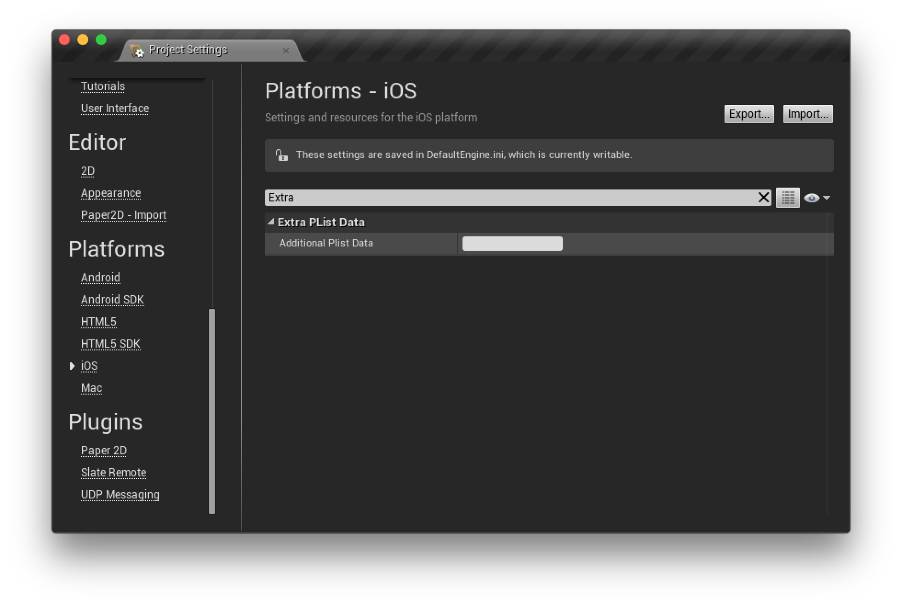

# Force Opetaion X 란?

Force Operation X (이하 F.O.X)는 스마트폰의 광고 효과 최적화를 위한 토탈 솔루션 플랫폼 입니다. 앱의 다운로드, 웹상에서의 사용자 액션의 측정은 물론, 스마트폰 사용자의 행동 특성에 근거한 독자적인 효과측정기준을 바탕으로 기업의 프로모션의 비용효과를 극대화 할 수 있습니다.

본 문서에서는 스마트폰 앱의 광고 효과 극대화를 위한 F.O.X SDK 도입 단계에 대해 설명합니다.

## F.O.X SDK 란?

F.O.X SDK를 앱에 도입함으로써 아래와 같은 기능을 제공합니다.

* **설치 계측**

광고 유입별 설치 횟수를 측정 할 수 있습니다.

* **LTV 측정**

유입원 광고별로 Life Time Value를 측정합니다. 주요 업적 지점으로는 회원 가입, 튜토리얼 돌파, 결제 등이 있습니다. 각 광고별 등록률, 과금률, 과금액 등을 측정 할 수 있습니다.

* **액세스 해석**

자연 유입과 광고 유입의 설치 비교, 앱의 기동수, 유니크 사용자수(DAU/MAU), 지속률 등을 측정 할 수 있습니다.

* **푸시 알림**

F.O.X에서 측정된 정보를 사용하여 사용자에게 푸시 알림을 할 수 있습니다. 예를 들어 특정 광고에서 유입된 사용자에게 메시지를 보낼 수 있습니다.

# 1. 개요

본 문서는 Force Operation X Unreal Engine (이하, UE) SDK 플러그인의 도입 단계에 대해 설명합니다. Force Operation X UE SDK 플러그인은 iOS 및 Android에 대응하고 있습니다.

Force Operation X SDK는 설치 및 LTV 측정 액세스 해석을 할 수 있습니다.

SDK 구현후에는 앱의 동작 및 효과 측정 결과에 문제가 없는것을 확인 한 후 마켓에 신청을 해야합니다. 효과 측정 테스트 절차는 Force Operation X 관리자가 연락드립니다.

## 1.1 SDK 사양


FOX SDK를 앱에 도입함으로써 아래의 기능을 제공합니다.


|처리|필수|개요|
|:------:|:------:|:------|
|설치 계측|필수|시작하면 브라우저가 시작되고 Cookie 측정에 의해 광고 효과 측정을 실시합니다. <br>컨버전수, CVR 등을 측정 할 수 있습니다.<br>메소드명:sendConversion|
|LTV 측정|옵션|임의의 성과 지점에서 성과통지를 하고, 광고별로 과금 수나 가입 수를 측정합니다. <br>결제 금액 탈퇴 수 등을 측정 할 수 있습니다. <br>메소드명:sendLtv|
|액세스 해석|옵션|앱 시작시 및 백그라운드부터 복귀시의 기동계측을 측정합니다. <br> 기동 수, 액티브 유저 수(DAU), 계속률 등을 측정 할 수 있습니다. <br> 메소드명:sendStartSession|


> Force Operation X SDK UE 플러그인은 네이티브판 SDK에 브리치를 행하는 래퍼로서 구현되어 있습니다.<br> SDK 도입에는 플러그인과 iOS 및 Android의 네이티브판 SDK가 필요합니다.

## 1.2	SDK 설명

다운로드한 SDK 「FOX_UnrealEngine_SDK_<version>.zip」의 압축을 풉니다.<br>
Source 폴더 내에 파일은 이하와 같습니다.


파일명|필수|개요
:--------:|:-------------:|:--------
FoxUePlugin.h|필수|헤더 파일. UE의 C++상에서 SDK를 사용하기 위한 래퍼.
FoxUePlugin.mm|	iOS 전용	|라이브러리 파일. UE의 C++에서 FOX iOS SDK를 사용하기 위한 iOS용 래퍼.
FoxUePlugin.cpp|Android 전용|라이브러리 파일. UE의 C++에서 FOX Android SDK를 사용하기 위한 Android용 래퍼.
FoxUIApplication.h|iOS 전용<br>필수|헤더 파일. UE의 C++에서 번들 버전을 제어하기 위한 래퍼.
FoxUIApplication.m|iOS 전용<br>필수|라이브러리 파일. UE의 C++에서 번들 버전을 제어하기 위한 래퍼.

iOS의 네이티브 SDK는 `ThirdParty/FoxSDK/iOS` 폴더에 들어 있습니다.

파일명|필수|개요
:--------:|:-------------:|:--------
AdManager.h|필수|헤더 파일. 광고의 효과를 측정.
libAppAdForce.a|필수|라이브러리 파일. 광고의 효과를 측정.
Ltv.h|옵션|헤더 파일. LTV를 측정.
AnalyticsManager.h|옵션|헤더 파일. 액세스를 해석.
Notify.h|옵션|헤더 파일. Push 통지.

Android의 네이티브 SDK는 `Intermediate/Android/APK/libs` 폴더에 들어 있습니다.

|파일명|필수|개요|
|:------:|:------:|:------|
|AppAdForce_vX.XXg.jar|필수|Android의 네이티브 SDK. 통상성과・LTV성과・액세스 해석을 측정 할 수 있습니다. |

SDK 디렉토리 및 파일 구조

```
|- ThirdParty
|   |- FoxSDK
|       |- FoxSDK.Build.cs
|       |- iOS
|           |- AdManager.h
|           |- Ltv.h
|           |- AnalyticsManager.h
|           |- libAppAdForce.a
|- Source
|   |- FoxUePlugin.h
|   |- iOS
|       |- FoxUePlugin.mm
|       |- FoxUIApplication.h
|       |- FoxUIApplication.mm
|   |- Android
|       |- FoxUePlugin.cpp
|- Intermediate
|   |- Android
|       |- APK
|           |- libs
|               |- AppAdForce_vX.XXg.jar
```

* `「FOX_UnrealEngine_SDK_{version}.zip」`에 「AppAdForce_vX.XXg.jar」파일이 존재하지 않는 경우에는 SDK 다운로드 사이트에서 `FOX_Android_SDK_{version}.zip`을 다운로드 하여 주십시오.
* `「FOX_UnrealEngine_SDK_{version}.zip」`에 네이티브 SDK 파일이 존재하지 않는 경우에는 SDK 다운로드 사이트에서 `FOX_iOS_SDK_{version}.zip`을 다운로드 하여 주십시오.

# 2. iOS용 Xcode 프로젝트 설정


## 2.1 라이브러리 추가

1. `ThirdParty/FoxSDK`폴더를 `/Users/Shared/UnrealEngine/4.X/Engine/Source/ThirdParty/`안에 복사.
2. `Source/FoxUePlugin.h`파일을 `$PROJECT_HOME/Source/$PROJECT_NAME`안에 복사.
3. `Source/iOS`폴더 안에 존재하는 모든 파일을 `$PROJECT_HOME/Source/$PROJECT_NAME`안에 복사.
4. `AppAdForce.plist`파일을 `$PROJECT_HOME/Saved/StagedBuilds/IOS/`안에 복사.
5. `$PROJECT_HOME/Source/$PROJECT_NAME/$PROJECT_NAME.Build.cs`를 이하와 같이 수정.
```cs
if (Target.Platform == UnrealTargetPlatform.IOS) {
    PublicDependencyModuleNames.AddRange(new string[] {"FoxSDK"});
}
```
6. UNREAL EDITOR의 [Settings] > [Project Settings] > [iOS] > [Extra Plist Data]에 이하의 설정을 추가. **`{my.scheme}`** 에는 어플리케이션을 기동하기 위한 URL 스키마를 지정.
```xml
<key>CFBundleURLTypes</key>
  <array>
    <dict>
      <key>CFBundleTypeRole</key>
      <string>Editor</string>
      <key>CFBundleURLSchemes</key>
        <array>
          <string>{my.scheme}</string>
        </array>
    </dict>
  </array>
<key>NSAppTransportSecurity</key>
<dict>
  <key>NSExceptionDomains</key>
    <dict>
      <key>app-adforce.jp</key>
        <dict>
          <key>NSExceptionAllowsInsecureHTTPLoads</key>
          <true/>
        </dict>
      <key>analytics.app-adforce.jp</key>
        <dict>
          <key>NSExceptionAllowsInsecureHTTPLoads</key>
          <true/>
        </dict>
    </dict>
</dict>
```




## 2.2 SDK 설정

SDK의 동작에 필요한 설정을 plist에 추가합니다. 「AppAdForce.plist」파일을 프로젝트의 원하는 위치에 생성하고 다음의 키와 값을 입력하십시오.

<table>
<tr>
  <th>Key</th>
  <th>Type</th>
  <th>Value</th>
</tr>
<tr>
  <td>APP_ID</td>
  <td>String</td>
  <td>Force Operation X 관리자가 연락합니다. 그 값을 입력하십시오.</td>
</tr>
<tr>
  <td>SERVER_URL</td>
  <td>String</td>
  <td>Force Operation X 관리자가 연락합니다. 그 값을 입력하십시오.</td>
</tr>
<tr>
  <td>APP_SALT</td>
  <td>String</td>
  <td>Force Operation X 관리자가 연락합니다. 그 값을 입력하십시오.</td>
</tr>
<tr>
  <td>APP_OPTIONS</td>
  <td>String</td>
  <td>아무것도 입력하지 마시고 빈문자의 상태로 해 주십시오.</td>
</tr>
<tr>
  <td>CONVERSION_MODE</td>
  <td>String</td>
  <td>1</td>
</tr>
<tr>
  <td>ANALYTICS_APP_KEY</td>
  <td>String</td>
  <td>Force Operation X 관리자가 연락합니다. 그 값을 입력하십시오.<br />액세스 해석을 이용하지 않으면 설정은 필요 없습니다.</td>
</tr>
</table>


[SDK 설정상세](./doc/config_plist/)

[AppAdForce.plist 샘플](./doc/config_plist/AppAdForce.plist)

# 3. Android용 프로젝트 설정
## 3.1 프로젝트에 도입
### 3.1.1 Unreal Engine 프로젝트에 도입

`「FOX_UnrealEngine_SDK_<version>.zip」`의 압축을 풀고 아래와 같이 해주세요.

* `Source`안의 "FoxUePlugin.h"와 `Source/Android`안의 "FoxUePlugin.cpp"를 `$PROJECT_HOME/Source/$PROJECT_NAME`안에 복사하고 UNREAL EDITOR에서 실행하는 빌드에 포함시킵니다.

### 3.1.2 Android 프로젝트에 도입

* `Intermediate/Android/APK`안의 「AppAdForce_vX.XX.jar」를 `$PROJECT_HOME/Intermediate/Android/APK/libs`폴더에 복사합니다.

[ 프로젝트에 도입 방법](./doc/integration/eclipse)

## 3.2 AndroidManifest.xml의 편집

`$PROJECT_HOME/Intermediate/Android/APK/AndroidManifest.xml`을 편집하고 측정에 필요한 정보를 정의합니다.

### 3.2.1 권한 설정

Force Operation X SDK를 실행하는 데 필요한 권한 설정을<manifest>태그에 추가합니다.
```xml
<uses-permission android:name="android.permission.INTERNET" />
<uses-permission android:name="android.permission.ACCESS_NETWORK_STATE" />
<uses-permission android:name="android.permission.READ_EXTERNAL_STORAGE" />
<uses-permission android:name="android.permission.WRITE_EXTERNAL_STORAGE" />
```

### 3.2.2 메타 데이터 설정
|매개변수명|필수|개요|
|:------|:------|:------|
|APPADFORCE_APP_ID|필수|Force Operation X 관리자가 연락합니다. 그 값을 입력하십시오.|
|APPADFORCE_SERVER_URL|필수|Force Operation X 관리자가 연락합니다. 그 값을 입력하십시오.|
|APPADFORCE_CRYPTO_SALT|필수|Force Operation X 관리자가 연락합니다. 그 값을 입력하십시오.|
|ANALYTICS_APP_KEY|필수|Force Operation X 관리자가 연락합니다. 그 값을 입력하십시오.|
|APPADFORCE_ID_DIR|옵션|내(외)부 스토리지를 이용할 때 임의의 저장할 디렉토리명을 지정할 수 있습니다. <br>미지정의 경우 패키지 이름 디렉토리가 생성됩니다.|
|APPADFORCE_ID_FILE|옵션|내(외)부 스토리지를 이용할 때 임의의 저장하는 식별자 파일명을 지정할 수 있습니다. <br>미지정인 경우 "__ FOX_XUNIQ__"에 파일이 생성됩니다.|
|APPADFORCE_USE_EXTERNAL_STORAG​​E|옵션|0을 지정하면 내(외)부 스토리지에 저장은 실행하지 않습니다.|

Force Operation X SDK의 실행에 필요한 정보를 <application> 태그에 추가합니다.
```xml
<meta-data android:name="APPADFORCE_APP_ID" android:value="1" />
<meta-data android:name="APPADFORCE_SERVER_URL" android:value="012345ABC" />
<meta-data android:name="APPADFORCE_CRYPTO_SALT" android:value="abcdef123" />
<meta-data android:name="ANALYTICS_APP_KEY" android:value="xxxxxx" />
```

### 3.2.3 설치 referer 측정 설정
설치 referer 측정을 위해 필요한 설정을 <application> 태그에 추가합니다.
```xml
	<receiver android:name="jp.appAdForce.android.InstallReceiver" android:exported="true">
		<intent-filter>
			<action android:name="com.android.vending.INSTALL_REFERRER" />
		</intent-filter>
</receiver>
```

이미 "com.android.vending.INSTALL_REFERRER"에 대한 receiver 클래스가 정의되어있는 경우에는, [2개의 INSTALL_REFERRER receiver를 공존시키는 경우 설정](./doc/install_referrer/)를 참조하십시오.

### 3.2.4 AndroidManifest.xml에 관련된 다른 설정
* [URL스키마 설정](./doc/config_url_scheme/)
* [(옵션)광고 ID를 이용하기위한 Google Play Services SDK의 도입](./doc/google_play_services/)
* [(옵션)외부 스토리지를 이용한 중복 제거 설정](./doc/external_storage/)
* [AndroidManifest.xml 설정 예](./doc/config_androidManifest/AndroidManifest.xml)

# 4 설치 계측의 구현
## 4.1 설치의 측정

처음 시작할 설치 계측을 구현하여 광고의 효과 측정을 할 수 있습니다. 처음 시작할 때 브라우저를 시작하고 광고 클릭시 부여 된 Cookie 정보를 조합하는 것으로 성과 측정합니다.

처음 시작할 때 계측을 하기 위해서, `BeginPlay()`메소드와 같은 어플리 케이션 기동 직후 반드시 호출되는 메소드에 효과 계측용의 처리를 추가합니다.

헤더 파일을 include
```cpp
	#include "FoxUePlugin.h"
```
성과 통지의 코드를 추가
```cpp
	FoxPlugin::sendConversion("default");
```
sendConversion 메소드의 인수는 일반적으로 위와 같이 "default" 라는 문자열을 그대로 지정하십시오.

* [sendConversion의 상세](./doc/send_conversion/)

## 4.2 URL 스키마 경유의 기동 측정(Re-engagement 측정)

URL 스키마 경유의 기동을 측정하기 위해서 OS 별로 이하와 같은 대응이 필요합니다.

### [iOS의 경우]

FoxUIApplication.\* 이 빌드에 포함되어 있다면, URL 스키마로 어플리케이션이 기동할때 호출되므로 코딩할 필요가 없습니다.


### [Android의 경우]

AndroidManifest.xml에서 URL 스키마가 설정되어 있는 모든 Activity의onResume안의 sendReengagementConversion 메소드를
코딩합니다.
주로 GameActivity가 대상이 됩니다만, 다른 Activity가 존재하는 경우에는 각각의 Activity에도 코딩 할 필요가 있습니다.

URL 스키마에 의한 어플리케이션 기동시의 시동 측정<br>
（GameActivity클래스 코딩예）

```java
// 클래스 임포트
import jp.appAdForce.android.AdManager;


public class GameActivity extends NativeActivity {

    @Override
    protected void onResume() {
        super.onResume();
        AdManager ad = new AdManager(this);
        ad.sendReengagementConversion(getIntent());
    }
}
```

URL 스키마로 기동된 Activity의 launchMode가 `singleTask` 또는 `singleInstance`의 경우는, URL 스키마 경유로 파라미터를 취득하기 위해 onNewIntent 메소드를 override하고, 이하의 같이 setIntent 메소드를 호출해 주세요.

```java
@Override
protected void onNewIntent(Intent intent) {
    super.onNewIntent(intent);
    setIntent(intent);
}
```

# 5. LTV 측정의 구현


LTV측정에 의해 광고 유입별 과금 금액 및 가입 횟수 등을 측정 할 수 있습니다. 측정을 위해 임의의 지점에 LTV 성과통신를 행하는 코드를 추가합니다.

소스 편집은, 성과가 오른 후에 실행되는 스크립트 처리를 설명합니다. 예를 들어 회원 가입이나 앱 내 과금 후 결제 측정에서는 등록·과금 처리 실행 후 콜백내에 LTV 측정 처리를 기술합니다.

성과가 앱 내부에서 발생하는 경우 성과 처리부에 아래와 같이 기술해 주십시오.

헤더를 include

```cpp
	#include "FoxUePlugin.h"
```

성과를 기술

```cpp
	FoxPlugin::sendLtv(성과지점ID);
```

> 성과 지점 ID(필수):관리자가 연락드린 값을 입력하십시오.


* [sendLtvConversion의 상세] (./doc/send_ltv_conversion/)


# 6. 액세스 해석

액세스 해석을 도입하여 자연 유입·광고 유입별의 기동 수, 액티브 유저 수(DAU / MAU), 지속률 을 측정 할 수 있습니다. 액세스 해석은 앱이 기동 또는 백그라운드에서 복귀 할 때 세션 측정을 행하는 코드를 추가합니다. 필요하지 않은 경우에는 본 항목의 구현을 생략 할 수 있습니다.

#### [iOS의 경우]
iOS의 경우 아래와 같은 설정이 필요합니다.

앱 기동 지점의 applicationDidFinishLaunching 및 applicationWillEnterForeground 모두 아래와 같이 설명합니다.

・헤더 파일 include

```cpp
	#include "FoxUePlugin.h"
```
・세션 측정 처리를 기술

```cpp
	FoxPlugin::sendStartSession();
```

#### [Android의 경우]
Android의 경우 아래와 같은 설정이 필요합니다.

앱 기동 및 백그라운드부터 복귀를 측정하기 위해 Activity의 onResume()에 코드를 추가합니다.

어플리케이션 기동 시의 기동 계측（GameActivity클래스 코딩예）

```java
// 클래스 임포트
import jp.appAdForce.android.AnalyticsManager;

public class GameActivity extends NativeActivity {

	@Override
	protected void onResume() {
		super.onResume();
		AnalyticsManager.sendStartSession(this);
	}
}
```


Java의 Activity에서 onResume()를 사용할 수없는 경우
어플리케이션의 기동 지점에 이하와 같이 코드를 추가 합니다.

```cpp
	#include "FoxUePlugin.h"

---

FoxPlugin::sendStartSession();
```

> ※ 어플리케이션이 백그라운드에서 복귀했을 때 그 Activity에 기동 측정의 구현이되어 있지 않은 경우 등 정확한 액티브 유저수가 측정 할 수 없습니다. <br>
※ Java의 Activity내의 onResume()와 C++ 양쪽 모두 sendStartSession()이 실행된 경우, 첫번째 유저로부터 이중으로 어플리케이션 시작 정보가 전송되므로 반드시 힌쪽만 코딩해 주십시오.

[액세스 해석에 의한 이벤트 계측](./doc/analytics_event/)

# 7 Android 프로젝트에서 ProGuard를 이용하는 경우
ProGuard를 이용하여 F.O.X SDK를 도입한 앱을 난독화 할 때 경고가 발생할 수 있습니다. 그 때 경고를 방지하기 위해 아래 설정을 추가하십시오.

```
-libraryjars libs/AppAdForce.jar
-keep interface jp.appAdForce.** { *; }
-keep class jp.appAdForce.** { *; }
-keep class jp.co.dimage.** { *; }
-keep class com.google.android.gms.ads.identifier.* { *; }
-dontwarn jp.appAdForce.android.ane.AppAdForceContext
-dontwarn jp.appAdForce.android.ane.AppAdForceExtension
-dontwarn com.adobe.fre.FREContext
-dontwarn com.adobe.fre.FREExtension
-dontwarn com.adobe.fre.FREFunction
-dontwarn com.adobe.fre.FREObject
-dontwarn com.ansca.**
-dontwarn com.naef.jnlua.**
```

※ GooglePlayServiceSDK를 도입하는 경우 아래 페이지에 기재되어 keep지정이 기술되어 있는지 확인하십시오.
[Google Play Services 도입시 Proguard대응](https://developer.android.com/google/play-services/setup.html#Proguard)


# 8 소통 테스트 실시

마켓에 신청까지 Force Operation X를 도입 한 상태에서 충분히 테스트하여 앱의 동작에 문제가 없는지 확인하십시오.

효과 측정 테스트의 자세한 내용은 관리자 연락하므로 그 절차에 따라 시험을 실시합니다.

성과를 위한 통신은 기동후 한번만 행하기 때문에 두 번째 이후의 시작에서 통신이 발생하지 않습니다. 계속 효과 측정 테스트를 실시하고 싶은 경우에는 앱을 제거하고 다시 설치 후 사용하십시오.

## 8.1 테스트 단계
SDK가 정상적으로 도입되고 있는지 확인하기위한 테스트 절차는 다음과 같습니다.
ProGuard를 걸고 출시를 할 경우 반드시 ProGuard를 건 상태에서 테스트 실시를 부탁드립니다.

1. 테스트 용 단말기에 테스트 앱이 설치되어있는 경우에는 제거
2. 테스트 용 단말기의 「설정」→ 「Safari」→ 「Cookie와 데이터를 삭제」에 의해 Cookie를 삭제
3. 당사에서 발행 한 테스트 용 URL을 클릭 <br>
   ※ 테스트 URL은 반드시 OS에 설정되어있는 기본 브라우저에서 요청되도록 하십시오.
기본 브라우저는 URL을 클릭했을 때 자동으로 시작하는 브라우저입니다.
메일 앱과 QR 코드 앱을 사용할 수 있으며 앱에서 WebView로 전환 한 경우에는 측정 할 수 없습니다.
4. 마켓에 리다이렉션 <br>
   ※ 테스트 URL의 경우에는 전환 대상이 아닌 오류 메시지가 표시되는 경우가 있습니다만 문제 없습니다.
5. 테스트용 단말기에 테스트 앱을 설치
6. 앱을 기동, 브라우저가 기동<br>
   ※ 여기에서 브라우저가 기동되지 않는 경우에는 정상적으로 설정이 이루어지고 있지 않습니다.
설정을 검토하여 문제가 없는 경우에는 당사에 문의하십시오.
7. LTV 지점까지 화면 전환
8. 앱을 종료하고 백그라운드에서 제거
9. 다시 앱을 기동
10. 당사에 3,6,7,9의 시간을 알려주십시오. 정상적으로 측정이 이루어지고 있는지 확인합니다.
11. 당사측의 확인에서 문제가 없다면 테스트 완료됩니다.

# 9. 마지막에 반드시 확인하시기 바랍니다 (지금까지 발생한 문제점들)

### URL스키마 설정이되지 않고 출시 되었기 때문에 브라우저에서 앱을 전환 할수없는
Cookie 측정을 할 때 브라우저를 기동한 경우에는 URL스키마를 이용하여 앱을 전환합니다.

이 때 독자의 URL스키마가 설정되어 있어야합니다.


### URL스키마에 대문자가 포함되어 성공적으로 앱에 전이되지 않습니다
환경에 따라 URL 체계 대소문자를 판별 하지않음으로써 정상적으로 URL 체계 전환 할 수없는 경우가 있습니다.
URL스키마는 모두 소문자로 설정해야합니다.

### F.O.X에서 확인 할 수 있는 설치수의 값이 마켓의 숫자보다 크다
F.O.X는 몇개의 방식을 조합하여 단말기의 중복 설치 검사를 실시하고 있습니다. 중복 감지 할 수 없는 설정은 동일한 단말기에서도 다시 설치 될 때마다 F.O.X는 신규 설치라고 판정해 버립니다. 중복 탐지의 정확성을 향상시키기 위해 아래와 같이 설정하십시오.

* [광고 ID를 이용하기 위한 Google Play Services SDK의 도입](./doc/google_play_services/)

* [(옵션) 외부 스토리지를 이용한 중복 제거 설정](./doc/external_storage/)
