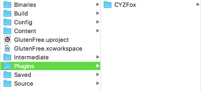
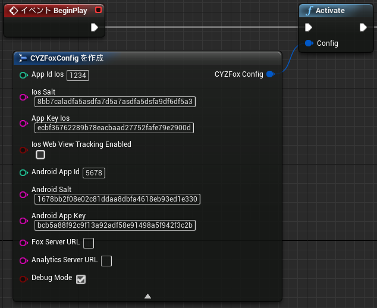
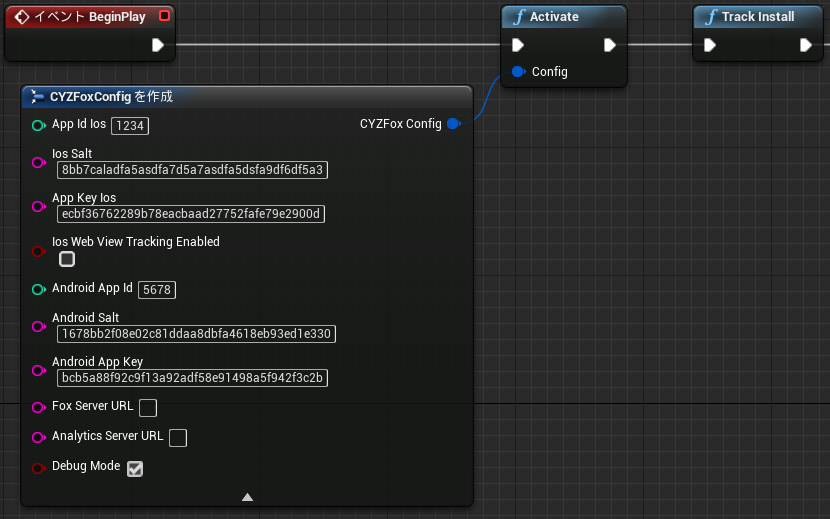
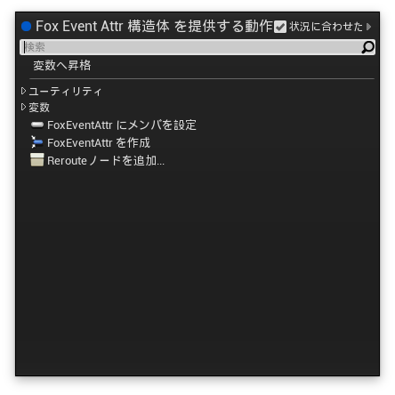
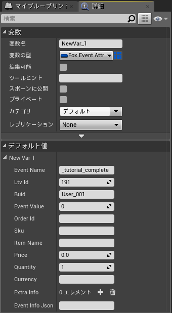

# Force Operation X 개요

Force Operation X (이하F.O.X)은 스마트폰의 광고 효과 최적화를 위한 토탈 솔루션 플랫폼입니다. 애플리케이션의 다운로드, 웹상의 유저 액션의 계측은 물론 스마트폰 유저의 행동 특성에 기반한 독자의 효과 측정 기준을 바탕으로 고객님의 프로모션의 비용 대 효과를 최대화 하는 것이 가능합니다.
이 문서는 스마트폰 애플리케이션의 광고 효과 최대화를 위한 F.O.X SDK도입 절차에 대하여 설명합니다.

## 목차

* **[1. 인스톨](#install_sdk)**
  * [SDK다운로드](https://github.com/cyber-z/public-fox-unrealengine-sdk/releases)
  * [iOS프로젝트 설정](./doc/integration/ios/README.md)
  * [Android프로젝트의 설정](./doc/integration/android/README.md)
* **[2. F.O.X SDK의 액티베이션](#activate_sdk)**
* **[3. 인스톨 계측의 구현](#track_install)**
	*	[인스톨 계측의 상세](./doc/track_install/README.md)
* **[4. 앱내부 이벤트의 설계](#track_event)**
	* [세션(기동)이벤트의 계측](#track_event)
	* [기타 앱내부 이벤트의 계측](#track_other_event)
	* [이벤트 계측의 상세](./doc/track_event/README.md)
* **[5. 확인 사항(반드시 확인하여 주십시오)](#trouble_shooting)**

---

## F.O.X SDK개요

F.O.X SDK의 애플리케이션을 도입하시면 이하의 기능을 실현합니다.

* **인스톨 계측**

광고 유입별 인스톨 수를 계측 가능합니다.

* **LTV계측**

유입 광고별 Life Time Value을 계측합니다. 자주 사용되는 성과 지점으로써는 회원등록, 튜토리얼 돌파, 과금등이 있습니다. 각 광고별 등록율, 과금율 및 과금액등을 계측가능합니다.

* **액세스 분석**

자연 유입 및 광고 유입의 인스톨 비교. 애플리케이션의 기동수 및 유니크 유저 수(DAU/MAU). 잔존율등을 계측 가능합니다.


<div id="install_sdk"></div>
## 1. 인스톨

이하의 페이지로부터 최신 SDK를 다운로드 하여 주십시오.

[SDK릴리스 페이지](https://github.com/cyber-z/public-fox-unrealengine-sdk/releases)

다운로드하신 SDK「FOX_UE4_Plugin_<version>.zip」를 해동후 애플리케이션의 프로젝트에 임포트하여 주십시오<br>
프로젝트 디렉토리 직하의 `Plugins`에 해동한 SDK디렉토리를 배치합니다.



> `Plugins`디렉토리가 없으신 경우에는 작성하신후 배치하여 주십시오

Plugins디렉토리에 SDK를 배치하시면 UnrealEditor의 Plugins 리스트 (`[설정] > [Plugins]`)에 FOXPlugin이 표시됩니다.<br>
`Enabled`에 체크 하신후 UnrealEditor를 재기동하여 주시면 프로젝트에의 도입은 완료입니다.


### 각OS별의 설정

* [iOS프로젝트의 설정](./doc/integration/ios/README.md)
* [Android프로젝트의 설정](./doc/integration/android/README.md)

<div id="activate_sdk"></div>
## 2. F.O.X SDK의 액티베이션

F.O.X SDK의 액티베이션을 실행하기위하여 앱의 기동지점에 이하의 구현을 행합니다.<br>
구현 방법은 블루프린트 및 C++의 ２가지 로써 제공하고 있습니다.

#### [ 블루프린트 ]

* 레벨 블루프린트(`[블루프린트] > [레벨 블루프린트를 열기]`)를 실행합니다.

* `이벤트 BeginPlay`를 배치합니다.
* 여백의 지점을 우클릭하여 `Fox Track`의 노드를 검색합니다.
* Fox Track의 리스트로부터`Activate Function`을 선택하여 배치합니다.


|매개변수|형|설명|
|:---|:---:|:---|
|Ios AppId|int|관리콘솔에서 발행한 iOS앱의 계측용 ID|
|Ios App Salt|char|관리콘솔에서 발행한iOS용 Salt|
|Ios App Key|char|관리콘솔에서 발행한 iOS용의 앱키|
|Ios Web View Tracking Enabled|bool|Web브라우저를 이용한 이벤트 계측 실시하는 경우 `true`로 설정합니다.|
|AndroidAppId|int|관리콘솔에서 발행한 iOS용의 계측용 ID|
|AndroidSalt|char|관리콘솔에서 발행한 Android용 Salt|
|AndroidAppKey|char|관리콘솔에서 발행한 Android용 앱 키|
|DebugMode|bool|디버그용 로그 출력 유효 플러그<br>디폴트 : false|


#### **[ C++ ]**

CYZFox.h를 include하여 앱 기동시에 반드시 호출되는 BeginPlay메소드 내에<br>
CYZUEFoxConfig를 설정하여 activate를 실행합니다.

```cpp
#include "CYZFox.h"
using namespace fox;
...

void FoxSample::BeginPlay()
{
  CYZUEFoxConfig config;
  config.ios_appId = 발행한 iOS앱 ID;
  config.ios_salt = "발행한 iOS앱의 APP_SALT";
  config.ios_appKey = "발행한 iOS앱의 APP_KEY";
  config.android_appId = 발행한 Android앱 ID;
  config.android_salt = "발행한 Android앱의 APP_SALT";
  config.android_appKey = "발행한 Android앱의 APP_KEY";
  config.debugMode = true;
  CYZFox::activate(config);
}
```


<div id="track_install"></div>
## 3. 인스톨 계측의 구현

초기 기동의 인스톨 계측을 구현하여 주시면 광고의 효과 측정을 하실 수 있습니다.

### 인스톨 계측의 구현

#### [ 블루 프린트 ]

이하와 같이`TrackInstall`노드를 추가합니다.<br>
Activate직후에 호출되는 것이 바람직하지만 별도의 BeginPlay에서 호출되는 경우에는 반드시 앱 기동시 또한 Activate의 이후에 실행 되도록 설정하여 주십시오.



> ※ TrackInstall은 반드시 Activate의 이후에 호출되도록 설정하여 주십시오. Activate보다 이전에 실행된 경우 필수 설정 정보가 로드 되어 있지 않은 이유로 계측을 할 수 없습니다.

#### [ C++ ]

인스톨 계측을 행하기 위하여 BeginPlay에서 `CYZFox::trackInstall`을 호출 합니다.

```cpp
#include "CYZFox.h"
using namespace fox;
...

void FoxSample::BeginPlay()
{
  CYZFox::trackInstall();
}
```

> ※ trackInstall은 반드시 activate의 이후에 호출되도록 설정하여 주십시오. activate보다 이전에 실행된 경우 필수 설정 정보가 로드 되어 있지 않은 이유로 계측을 할 수 없습니다.

*	[인스톨 계측의 상세](./doc/track_install/README.md)

<div id="track_event"></div>
## 4. 앱 내 이벤트의 계측

기동 세션, 회원 등록, 튜토리얼 돌파, 과금 등 임의의 성과지점에 이벤트 계측을 구현 하는 것으로써 유입처 광고의 LTV 및 잔존율을 측정 가능합니다. 이와같은 이벤트 계측이 불필요한 경우에는 각 항목의 구현을 생략 가능힙니다.

<div id="track_session"></div>
### 세션 (기동)이벤트의 계측

자연 유입과 광고 유입의 인스톨 수 비교, 애플리케이션의 기동수 및 유니크 유저 수(DAU/MAU), 잔존율등을 계측하는 것이 가능합니다. 액세스 분석이 불필요한 경우에는 본 항목의 구현을 생략가능합니다.
<br>
애플리케이션이 기동 또는 백그라운드로부터 복귀하는 경우에는 세션 계측을 행하는 코드를 추가합니다. 불필요한 경우에는 구현을 생략가능합니다.

#### [ 블루 프린트 ]

TrackSession노드를 추가하여 호출합니다.


#### [ C++ ]

```cs
#include "CYZFox.h"
using namespace fox;
...

	CYZFox.trackSession();
```

<div id="track_other_event"></div>
### 기타 앱 내 이벤트의 계측

회원등록, 튜토리얼 돌파, 과금등 임의의 성과지점에 이벤트 계측을 구현하는 것으로 유입처 광고의 LTV를 계측하는 것이 가능합니다.<br>
이벤트 계측이 불필요한 경우에는 본 항목의 구현을 생략 가능합니다.<br>
성과가 앱 내부에서 발생하는 경우 블루 프린드 또는 C++에 성과 처리부에 이하의 예와 같이 실행하여 주십시오.<br>

이벤트 계측에는 CYZFoxEvent.h에 계측 대상이 되는 이벤트의 각 매개변수를 격납하여 CYZFox::trackEvent의 인수로써 계측합니다.

#### **[튜토리얼 이벤트의 계측 예]**

#### [ 블루 프린트 ]

* 이벤트가 발생하는 타이밍에 TrackEvent노드를 추가합니다.
<br><br>

<br><br>
* `Attr`으로부터 노드 추가 메뉴를 실행하여, `변수에 승격`을 선택합니다.

<br><br>
* 추가한 변수에 각 매개변수를 set합니다. 이 튜토리얼 이벤트의 설정 예로써 아래의 값을 설정합니다.<br><br>
・EventName : _tutorial_complete<br>
・Ltv Id : 191 (관리 콘솔에서 발행한 ID입니다.)<br>
・Buid : User_001
<br><br>

<br><br>

값을 동적으로 설정하는 경우 변수에 승격을 실행이 아닌 직접 각 매개변수에 값을 설정합니다.


#### [ C++ ]

코드에 구현하는 경우 이하와 같이 구현합니다.

```cs
#include "CYZFox.h"
#include "CYZFoxEvent.h"

using namespace fox;
...
  const char* eventName = "_tutorial_comp";
  uint ltvId = 성과지점 ID;
  CYZFoxEvent e = new CYZFoxEvent(eventName, ltvId);
  e.buid = "USER_001"
  CYZFox::trackEvent(e);
```

> 성과지점ID(필수)：관리자로부터 연락합니다. 연락받은 값을 입력하여 주십시오. 또는 관리콘솔 상의 성과지점 설정 화면 상에서 직접 확인 가능합니다.

> LTV계측을 실행하는 경우 각 성과 지점을 식별하는 `성과 지점 ID`를 지정할 필요가 있습니다. FoxEvent의 Constructor의 두번쨰 인수에 발행된 ID를 지정하여 주십시오.

#### **[과금 이벤트의 계측 예 ]**

#### [ 블루 프린트 ]


#### [ C++ ]

과금 계측을 실행하실 경우 과금이 완료된 지점에 이하와 같이 과금액을 지정하여 주십시오.

```cs
using Cyz;
...

	int ltvId = 성과 지점ID;
	double price = 1.2;
	String currency = "USD";
	CYZFoxEvent purchase = CYZFoxEvent::makePurchase("_purchase", ltvId, price, currency);
	purchase.buid = "USER_001"
	purchase.orderId = "ABCDEFG12345";
	purchase.itemName = "Coin";
	purchase.sku = "A-001"
	purchase.quantity = 1;
	CYZFox::trackEvent(purchase);
```

> currency의 지정에는 [ISO 4217](http://ko.wikipedia.org/wiki/ISO_4217)에 정의된 통화 코드를 지정하여 주십시오.

* [이벤트 계측의 상세](./doc/track_event/README.md)

<div id="trouble_shooting"></div>
## 5. 확인 사항（이제까지 발생한 트러블 모음）

### 5.1. URL스키마의 설정이 되어 있지 않은 상태에서 릴리스 된 앱의 초기기동 브라우져에서의 앱의 복귀가 실패

Cookie계측을 실행하기 위해서는 외부 브라우져를 기동한후에 앱에 복귀하기 위하여 URL스키마를 이용하여 애플리케이션에 복귀할 필요가 있습니다. 이 때에 독자의 URL스키마를 설정하여 주실 필요가 있습니다. URL스키마를 설정하지 않은 상태에서 릴리스 된 경우에는 이와 같은 앱의 기동이 실패합니다.

### 5.2. URL스키마에 대문자 및 기호가 포함되어 정상적인 앱의 기동 실패

환경에 따라 URL스키마의 대문자 소문자가 판별되지 않는 현상에 의해 정상적인 URL스키마의 실행이 되지 않는 경우가 있습니다. URL스키마는 전부 소문자의 알파벳 및 숫자로써 설정하여 주십시오.


### 5.3. URL스키마의 설정이 타사의 앱과 같은 경우 브라우저로부터 타사의 앱을 기동

iOS에서 복수의 앱에서 동일한 URL스키마가 설정되어 있는 경우 어떤 앱이 기동할지는 정해저 있지 않습니다. 확실한 특정 앱의 기동이 되지 않으므로 URL스키마는 타사의 앱과 중복되지 않도록 일정수준 이상의 복잡성이 있는 스키마를 설정하여 주십시오.

### 5.4. 단시간에 대량의 유저 획득을 위한 프로모션을 실시한 경우 정상적인 계측 실패

iOS에는 앱 기동시에 일정 시간 이상 메인 쓰레드가 블록된 경우 앱을 강제 종료하는 사양이 있습니다. 기동시의 초기화 처리등 메인 쓰레드상에 서버에 동기 통신을 행하지 않도록 주의하여 주십시오. 리워드 광고등의 대량의 유저를 단시간에 획득한 결과 서버에 액세스가 집중하여 통신의 레스폰스가 악화된 경우 애플리케이션의 기동에 시간이 걸리므로 기동시에 강제 종료되어 정상적인 광고 성과가 계측되지 않는 사례가 있습니다.
이하의 절차로써 이와같은 상황에 대하여 테스트를 실행 가능하므로 이하의 설정으로 애플리케이션이 정상적으로 기동하는가를 확인하여 주십시오.

`iOS「설정」→「디벨롭퍼」→「NETWORK LINK CONDITIONER」`

* 「Enable」을 ON
* 「Very Bad Network」을 체크


### 5.5. F.O.X에서 확인된 인스톨 수의 값이 Google Play Developer Console의 수치보다 큰 경우

F.O.X에서는 몇가지 방식을 조합하여 단말의 중복 인스톨을 검치하고 있습니다.
중복 검치가 실행되지 않는 설정에서는 동일 단말에서 재인스톨이 될때마다 F.O.X는 신규의 인스톨로써 판정합니다.

중복 검치의 정확성을 향상시키기 위하여 아래의 설정을 행하여 주십시오.

* [（옵션）외부 스토레지를 이용한 중복 배제 설정](/lang/ko/doc/integration/android/external_storage/README.md)

---
[TOP Menu](/README.md)
