# 什么是Force Operation X

Force Operation X (下面简称F.O.X)是一款基于智能手机的，用来最大改善广告效果的综合解决方案平台。除了对APP下载量和网络用户操作的基本计测外，还能基于手机用户行为特性采用独自效果计测基準，实现了企业宣传推广时费用与效果比的最大改善。

在这个文档里，详细讲解了基于智能手机平台优化广告效果的F.O.X SDK的导入步骤。

## 目录

* **[1. 导入](#install_sdk)**
  * [SDK下载](https://github.com/cyber-z/public-fox-unrealengine-sdk/releases)
  * [iOS项目设置](./doc/integration/ios/README.md)
  * [Android项目设置](./doc/integration/android/README.md)
* **[2. F.O.X SDK激活](#activate_sdk)**
* **[3. Install计测执行](#track_install)**
	*	[Install计测详细](./doc/track_install/README.md)
* **[4. APP内事件计测](#track_event)**
	* [session(启动)事件计测](#track_event)
	* [其他APP内事件计测](#track_other_event)
	* [事件计测详细](./doc/track_event/README.md)
* **[5. 最后的注意事项](#trouble_shooting)**

---

## 什么是F.O.X SDK

将F.O.X SDK导入APP之后，能够实现以下功能。

* **Install计测**

能够计测不同广告带来的安装数。

* **LTV计测**

可以计测不同广告来源的Life Time Value。主要的成果地点为会员注册、新手引导完成、付费等。能够分别监测各广告的登录率、付费率以及付费金额。

* **流量分析**

比较自然流入和广告流入带来的安装数。能够计测App的启动次数和唯一用户数(DAU/MAU)、留存率等。


<div id="install_sdk"></div>

## 1. 导入

请从以下页面中下载最新安定版(Latest release)SDK。

[SDK发行页面](https://github.com/cyber-z/public-fox-unrealengine-sdk/releases)

下载并展开SDK「FOX_UE4_Plugin_&lt;version&gt;.zip」，将`Plugins`的`CYZFox`安装至APP项目中。<br>
在项目路径下的`Plugins`中放置已解压的SDK目录。

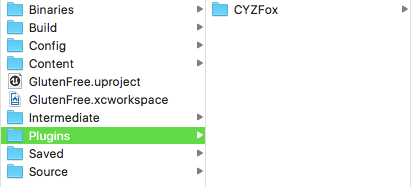

> 没有`Plugins`目录时，请新建目录。

插件目录中放置SDK后，UnrealEditor的Plugins一览 ( [设置] > [Plugins] )中将会显示`CyberZ Fox`。<br>
在导入插件的`Enabled`做勾选，重新启动UnrealEditor后，导入项目完成。。

* `FOX SDK` : SDK主体插件。请务必在Enabled中勾选。
* `FOX SDK Blueprint Library` : 在蓝图中调用FOX SDK时，请在Enable中勾选。

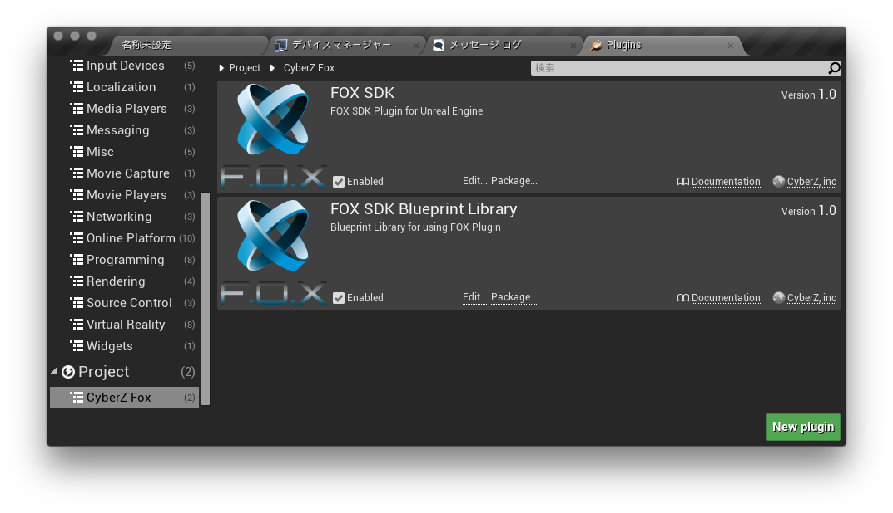


### 根据OS设置

* [iOS项目设置](./doc/integration/ios/README.md)
* [Android项目设置](./doc/integration/android/README.md)

<div id="activate_sdk"></div>
## 2. F.O.X SDK激活

为激活F.O.X SDK，需在APP启动时执行以下代码。<br>
执行方法分为蓝图和C++两种。

#### [ 蓝图]

* 打开关卡蓝图(`[蓝图] > [打开关卡蓝图]`)。
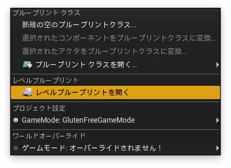
* 配置事件`BeginPlay`。
* 在空白处右键，搜索`Fox Track`的节点。
* Fox Track一览中选择并`Activate Function`去做配置。
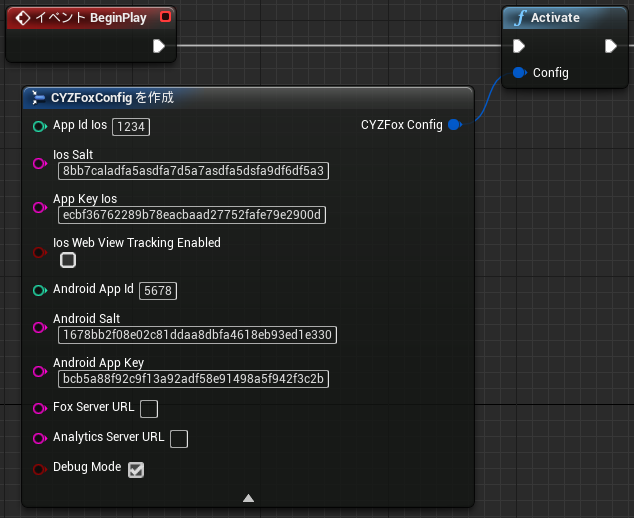

|参数|型|说明|
|:---|:---:|:---|
|Ios AppId|int|管理画面中发行的iOS版计测使用的APP ID|
|Ios App Salt|char|管理画面中发行的iOS Salt|
|Ios App Key|char|管理画面中发行的iOS APP key|
|Ios Web View Tracking Enabled|bool|使用Web浏览器进行事件计测时，设为`true`。|
|AndroidAppId|int|管理画面中发行的Android版计测使用的ID|
|AndroidSalt|char|管理画面中发行的Android Salt|
|AndroidAppKey|char|管理画面中发行的Android APP key|
|DebugMode|bool|调试日志输出有效标记<br>默认:false|


#### **[ C++ ]**

安装CYZFox.h，APP启动时调用的BeginPlay方法中<br>
设置CYZUEFoxConfig，执行activate。

```cpp
#include "CYZFox.h"
using namespace fox;
...

void FoxSample::BeginPlay()
{
  CYZUEFoxConfig config;
  config.ios_appId = 发行的iOS APP ID;
  config.ios_salt = "发行的iOS APP_SALT";
  config.ios_appKey = "发行的iOS APP_KEY";
  config.android_appId = 发行的Android APP ID;
  config.android_salt = "发行的Android APP_SALT";
  config.android_appKey = "发行的Android APP_KEY";
  config.debugMode = true;
  CYZFox::activate(config);
}
```


<div id="track_install"></div>

## 3. 执行Install计测

通过在首次启动APP时进行Install计测，可以测定广告流入效果。

### 执行Install计测

#### [ 蓝图 ]

按下列所示添加`TrackInstall`节点。<br>
Activate之后立即调用最佳，其他BeginPlay中调用时，请务必设置为启动APP时且在Activate后执行。

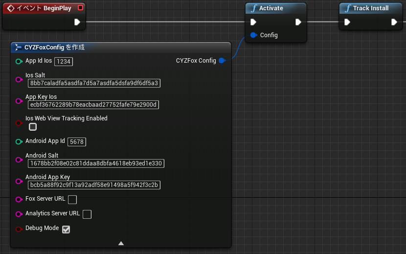

> ※ TrackInstall请务必设置为在Activate后执行。在Activate前执行时，会因为所需信息未加载而导致计测失败。

#### [ C++ ]

进行Install计测时，在BeginPlay中调用`CYZFox::trackInstall`。

```cpp
#include "CYZFox.h"
using namespace fox;
...

void FoxSample::BeginPlay()
{
  CYZFox::trackInstall();
}
```

> ※ trackInstall请务必设置为在Activate后执行。在Activate前执行时，会因为所需信息未加载而导致计测失败。

*	[Install计测详细](./doc/track_install/README.md)

<div id="track_event"></div>

## 4. APP内事件计测

启动session、会员注册、新手引导突破、付费等任意成果地点中进行事件计测，可以计测广告渠道的LTV和留存率，如不需要以上结果，可以略过。

<div id="track_session"></div>

### session（启动）事件计测

可以计测自然流入和广告流入的安装数对比、APP启动次数和唯一用户人数（DAU/MAU)、留存率等。如不需要流量分析，可以忽略本项。
<br>
APP启动时或从后台恢复时添加session计测代码。无需该计测时，可以忽略本项。

#### [ 蓝图 ]

添加TrackSession节点并调用。

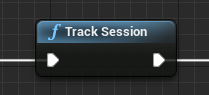

#### [ C++ ]

```cs
#include "CYZFox.h"
using namespace fox;
...

	CYZFox.trackSession();
```

<div id="track_other_event"></div>

### 其他APP内事件计测

在会员注册，新手引导完成，付费等任意成果地点执行事件计测，能够测定广告流入源的LTV。<br>
无需事件计测时，可以忽略本项。<br>
成果在APP内部产生的情况，请在蓝图或C++的成果处理部分中进行以下描述。<br>

事件计测时，CYZFoxEvent.h放置了计测对象的事件参数，作为CYZFox::trackEvent的参数进行计测。

#### **[新手引导事件计测案例]**

#### [ 蓝图 ]

* 事件产生时添加TrackEvent节点。
<br><br>
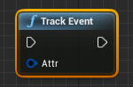
<br><br>
* `Attr`中打开节点添加菜单，选择`升级到变量`。
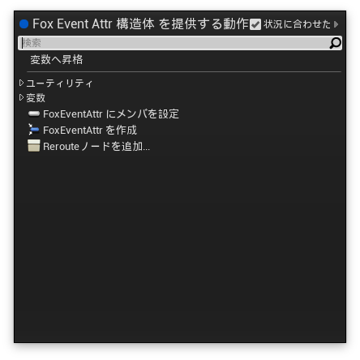
<br><br>
* 在添加的变量中设置各参数。以下数值为新手引导事件的设置案例。<br><br>
・EventName : _tutorial_complete<br>
・Ltv Id : 191 (管理画面中发行的ID)<br>
・Buid : User_001
<br><br>
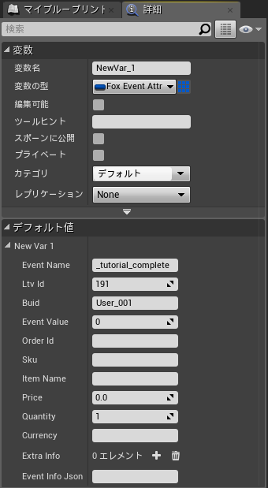
<br><br>

数值为动态时，不进行升级变量，直接在各参数中设置数值。

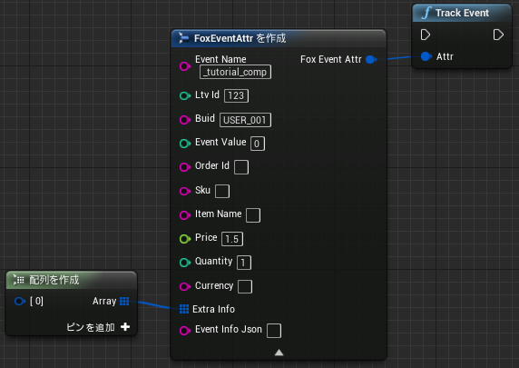


#### [ C++ ]

按以下方法在代码中执行。

```cs
#include "CYZFox.h"
#include "CYZFoxEvent.h"

using namespace fox;
...
  const char* eventName = "_tutorial_comp";
  uint ltvId = 成果地点ID;
  CYZFoxEvent e = new CYZFoxEvent(eventName, ltvId);
  e.buid = "USER_001"
  CYZFox::trackEvent(e);
```

> 成果地点ID(必须)：请输入管理者告知的值。

> 进行事件计测时，需指定识别成果地点的`成果地点ID`。FoxEvent构造函数的第二参数中请指定发行的ID。。

#### **[付费事件计测案例]**

#### [ 蓝图 ]

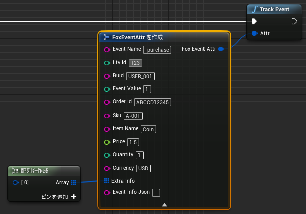

#### [ C++ ]

进行付费计测时，请在付费完成的位置指定付费金额。

```cs
using Cyz;
...

	int ltvId = 成果地点ID;
	double price = 1.2;
	String currency = "USD";
	CYZFoxEvent purchase = CYZFoxEvent::makePurchase("_purchase", ltvId, price, currency);
	purchase.buid = "USER_001"
	purchase.orderId = "ABCDEFG12345";
	purchase.itemName = "Coin";
	purchase.sku = "A-001"
	purchase.quantity = 1;
	CYZFox::trackEvent(purchase);
```

> currency中请指定[ISO 4217](http://ja.wikipedia.org/wiki/ISO_4217)中定义的货币代码。

* [事件计测详细](./doc/track_event/README.md)

<div id="trouble_shooting"></div>

## 5. 最后需确认内容（常见问题集）

### 5.1. 未设置URL SCHEME 进行发布时无法从浏览器跳转至APP

进行Cookie计测时启动浏览器以后，必须使用URL scheme跳转回到APP画面。
此时需要设置URL scheme，未设置scheme就上线发布的话会导致无法正常迁移。

### 5.2. URL SCHEME中含有大写字母时，无法正常跳转APP。

根据运行环境，会出现因为URL SCHEME 的大小写字母不能判定而导致URL SCHEME 无法正常迁移的情况。
请将URL SCHEME 全部设置为小写英文或数字或小数点。

### 5.3. URL scheme设置与其他公司APP相同时，浏览器会跳转其他APP

iOS中，多个APP设置为同一个URL scheme时，会随机启动APP。由于可能导致无法启动指定的APP，请将URL scheme区别与其他APP来设定。

### 5.4. 进行短时间内获取大量用户的推广时无法正确计测

iOS中，APP启动时超过一定时间主线程被阻止运行时，会强制关闭APP。请注意不要让启动时的初始化处理在主线程上与服务器同时进行通讯。短时间内获得大量用户的激励广告等会因为集中访问服务器，通讯回复较差而导致APP启动时间延长或强制关闭等情况，从而导致无法正确计测广告结果。

按照以下步骤可以进行以上情况的测试，请进行以下设置，确认APP是否正常启动。

`iOS「设置」→「属性」→「NETWORK LINK CONDITIONER」`

* 「Enable」设置为on
*  勾选「Very Bad Network」

### 5.5. F.O.X中安装数的值会大于Google Play Developer Console的数值

F.O.X结合多种方式来进行终端重复安装的检查。 当设置无法进行检查重复时，同一终端的再次安装可能会被F.O.X判定为新的安装。

为提高排查重复的精度，请进行下面的设置。

* [（任意）利用外部储存优化重复排除](/lang/ja/doc/integration/android/external_storage/README.md)

---
[Top](/README.md)
