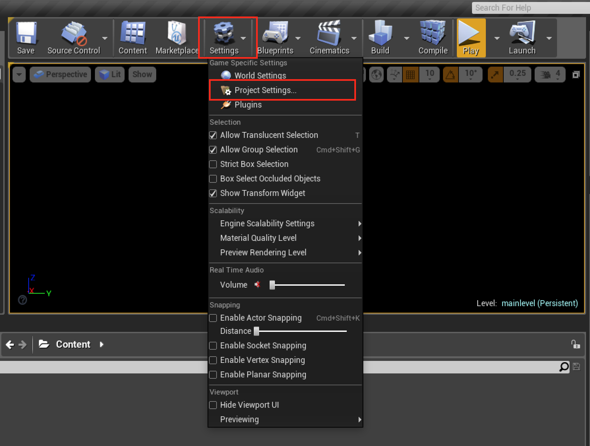
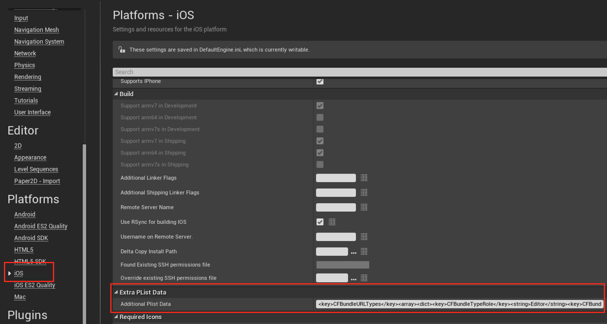
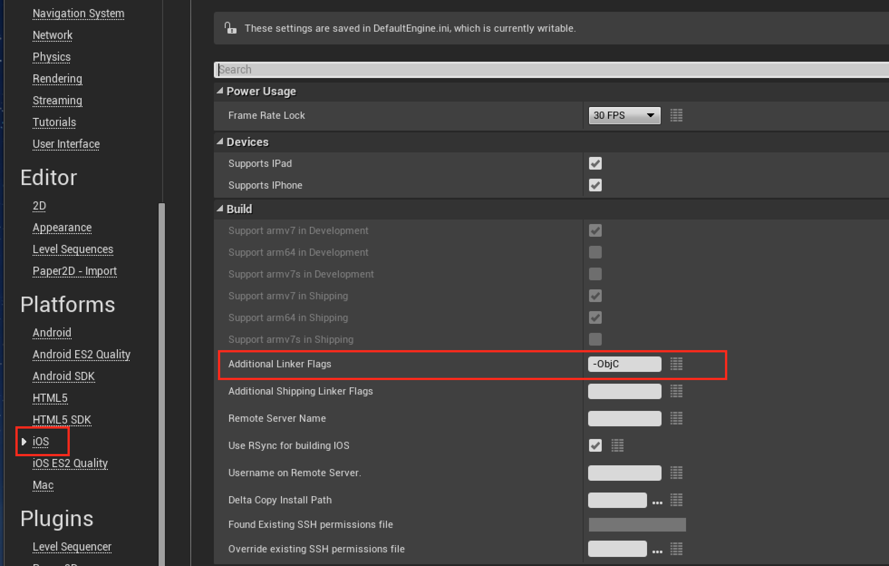

[TOP](../../../README.md)　>　**iOS 项目设置详细**

---

# iOS 项目设置详细

## **1.设置自定义 URL Scheme**
请进行以下任意设置。

### UE4Editor中进行设置时
UE4Editor工具中 `Settings > Project Settings > iOS > Extra Plist Data`中添加以下设置。
```xml
<key>CFBundleURLTypes</key><array><dict><key>CFBundleTypeRole</key><string>Editor</string><key>CFBundleURLSchemes</key><array><string>my.game</string></array></dict></array>
```



### 直接编辑ini文件时
1. `[project folder]/Config/DefaultEngine.ini`文件中打开。
2. 找出`[/Script/IOSRuntimeSettings.IOSRuntimeSettings]`的设置场所，如果没有请添加。
3. 添加以下设置。
```ini
AdditionalPlistData=<key>CFBundleURLTypes</key><array><dict><key>CFBundleTypeRole</key><string>Editor</string><key>CFBundleURLSchemes</key><array><string>my.game</string></array></dict></array>
```

> 上述中`my.game`仅为例子，请根据各自的URL Scheme进行修改。

## **2. 编译设置**
`CYZFox` 插件使用Objective-C Category 类扩张功能，请按以下方法在编译设置中添加`-ObjC`标记。

### UE4Editor中进行设置时
UE4Editor工具中 `Settings > Project Settings > iOS > Additional Linker Flags`中添加`-ObjC`。



### 直接编辑ini文件时
1. `[project folder]/Config/DefaultEngine.ini`文件中打开。
2. `[/Script/IOSRuntimeSettings.IOSRuntimeSettings]`的设置场所，如果没有请添加。
3. 添加以下设置。
```ini
AdditionalLinkerFlags=-ObjC
```
---

[Top](../../../README.md)
